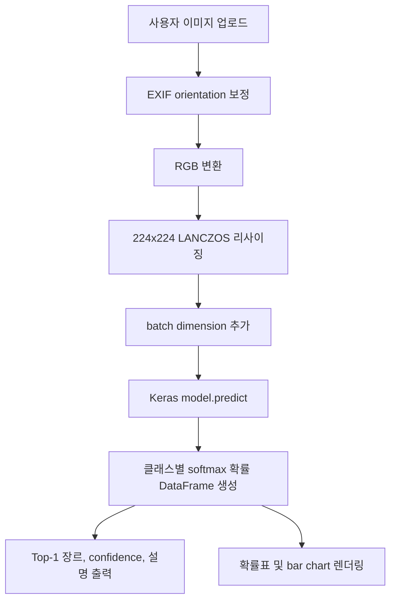

# Art Classifier Research PRD

## 딥러닝 기반 회화 사조 분류 모델 개발 및 프로토타입 명세서

**Project**: Art Classifier, 미술 사조 다중 클래스 이미지 분류  
**Owner**: 유소은  
**Document type**: Product Requirements Document + Research Design Report  
**Revision date**: 2026-06-30  
**Primary implementation**: `C:/AIproject/project/deepLearning01/artClassifier.ipynb`, `C:/AIproject/project/deepLearning01/artClassifier.py`

---

## Abstract

본 문서는 WikiArt Art Movements/Styles 이미지 데이터셋을 활용하여 회화 작품의 미술 사조를 자동 분류하는 딥러닝 기반 이미지 분류 시스템의 연구 설계, 구현 명세, 성능 평가, 제품화 요구사항을 통합 정리한 문서이다. 프로젝트는 전체 13개 사조(장르), 42,500장 규모의 원천 데이터 중 시각적 구분성이 비교적 명확하고 환경적 제약 내에서 다룰 수 있는 5개 사조(`Art_Nouveau(아르누보)`, `Baroque(바로크 양식)`, `Japanese_Art(일본 미술)`, `Realism(현실주의)`, `Western_Medieval(서양 중세 미술)`)를 선정하고, 클래스당 200장씩 총 1,000장을 균형 표본으로 구성하였다. 모델은 Custom CNN, EfficientNetB0, ResNet50 전이학습 구조를 비교하였고, MLflow 기반 하이퍼파라미터 탐색을 통해 ResNet50 기반 모델을 최종 후보로 선정하였다. 주피터 노트북 실행 기준 최종 MLflow 모델은 validation accuracy 0.7400, weighted F1-score 0.7422를 기록하였으며, 5-fold 교차검증 평균 accuracy는 0.6810으로 확인되었다. Streamlit 프로토타입은 최종 Keras 모델을 로드하여 이미지 업로드, 예측 장르, 클래스별 확률, 장르 설명을 제공한다.

**Keywords**: Art Classification, WikiArt, Transfer Learning, ResNet50, EfficientNetB0, MLflow, Streamlit, Computer Vision

---

## 1. Source Traceability

본 PRD는 다음 산출물의 내용을 통합 반영하였다.

| 구분 | 경로 | 반영 내용 |
|---|---|---|
| 최신 학습 노트북 | `C:/AIproject/project/deepLearning01/artClassifier.ipynb` | 데이터 구성, 모델 학습, MLflow 튜닝, classification report, confusion matrix, K-fold 결과, loss gap |
| Streamlit 앱 | `C:/AIproject/project/deepLearning01/artClassifier.py` | 모델 로드 후보, 커스텀 객체 처리, 이미지 추론, 확률 시각화, 미술관형 UI |
| 프로젝트 수행내역서 | `C:/Users/human-34/Desktop/AI 프로젝트/딥러닝 프로젝트/유소은_딥러닝프로젝트.docx` | 배경, 목적, 과제 범위, 데이터셋 설명, 전처리 및 회고 |
| HTML 산출물 보고서 | `C:/Users/human-34/Desktop/AI 프로젝트/딥러닝 프로젝트/유소은_딥러닝_산출물_보고서.html` | 보고서 구성, 최종 모델 해석, Streamlit 프로토타입 설명 |
| 목차 상세 | `C:/Users/human-34/Desktop/AI 프로젝트/딥러닝 프로젝트/목차 상세.docx` | 학회형 보고서 목차, 실패 사례 분석, 향후 개선 항목 |
| 목차 텍스트 | `C:/Users/human-34/Desktop/AI 프로젝트/딥러닝 프로젝트/목차.txt` | 프로젝트 개요, 데이터 분석, 전처리, 모델 비교, 결론 구조 |

### 1.1 Metric Provenance Note

첨부 HTML 산출물 보고서에는 별도 로컬 재검증 기준으로 `accuracy=0.9450`, `weighted F1-score=0.9446`이 기록되어 있다. 반면 최신 `artClassifier.ipynb` 실행 출력은 MLflow 최종 모델 기준 `validation accuracy=0.7400`, `weighted F1-score=0.7422`, K-fold 평균 `accuracy=0.6810`으로 남아 있다. 본 PRD의 공식 재현 기준은 최신 노트북 출력값으로 둔다. HTML 보고서의 0.9450 수치는 별도 모델 파일 또는 validation split provenance가 확인될 때까지 "secondary verification record"로 관리한다.

---

## 2. Research Problem and Product Vision

### 2.1 연구 문제

회화 작품의 사조는 색채, 질감, 선, 구도, 원근법, 소재, 시대적 표현 관습이 복합적으로 반영된 시각적 범주이다. 대규모 디지털 아카이브에서 작품 이미지를 수작업으로 분류하는 방식은 비용과 시간이 많이 들며, 분류 기준의 일관성도 작업자에 따라 달라질 수 있다. 본 프로젝트는 회화 이미지만을 입력으로 사용하여 미술 사조를 자동 추론하는 딥러닝 기반 분류 모델의 가능성을 검증한다.

### 2.2 제품 비전

Art Classifier는 미술 이미지 데이터셋을 분석하고, 사용자가 업로드한 회화 이미지의 사조를 예측하며, 예측 확률과 장르 설명을 함께 제공하는 경량 컴퓨터 비전 프로토타입이다. 장기적으로는 디지털 아카이브 자동 태깅, 교육용 미술사 도구, 작품 검색 보조, 맞춤형 작품 추천 시스템의 기반 모듈로 확장할 수 있다.

### 2.3 연구 질문

1. 클래스당 200장의 제한된 표본으로도 ImageNet 사전학습 모델을 활용해 회화 사조 분류 성능을 확보할 수 있는가?
2. Custom CNN, EfficientNetB0, ResNet50 중 제한된 학습 환경에서 validation loss와 accuracy 기준으로 가장 안정적인 모델은 무엇인가?
3. 사조 간 시각적 유사성은 어떤 혼동 패턴으로 나타나는가?
4. 노트북 기반 모델을 Streamlit 기반 사용자 프로토타입으로 전환할 때 필요한 모델 로드, 전처리, 오류 처리 요구사항은 무엇인가?

---

## 3. Project Scope

### 3.1 In Scope

| 범위 | 내용 |
|---|---|
| 데이터 수집 및 정리 | WikiArt Art Movements/Styles 데이터셋 구조 확인, 클래스별 이미지 수 집계 |
| 표본 구성 | 5개 사조 선정, 클래스당 200장 균형 추출, train/validation 8:2 분할 |
| 이미지 전처리 | RGB 변환, 224x224 리사이징, TensorFlow Dataset 파이프라인 구성 |
| 데이터 증강 | 좌우 반전, 소폭 회전, 확대/축소, 이동, 대비 조정 |
| 모델링 | Custom CNN, EfficientNetB0, ResNet50 학습 및 비교 |
| 실험 추적 | MLflow 기반 하이퍼파라미터 탐색, metric 및 모델 checkpoint 기록 |
| 성능 평가 | validation report, confusion matrix, loss gap, K-fold cross validation |
| 프로토타입 | Streamlit 기반 이미지 업로드 및 사조 예측 앱 |

### 3.2 Out of Scope

- 전체 WikiArt 13개 클래스의 완전 분류 모델
- 작가 식별, 작품명 인식, 제작 연도 추정, 오브젝트 탐지
- 저작권 검증 자동화
- 사용자 로그인 기능, 예측 이력 데이터베이스, 운영 배포 API
- 메타데이터 기반 멀티모달 모델링

---

## 4. Dataset

### 4.1 데이터 출처

- Dataset: WikiArt Art Movements/Styles
- Source: Kaggle, `https://www.kaggle.com/datasets/sivarazadi/wikiart-art-movementsstyles/data`
- Data type: 미술 사조별 폴더 구조를 가진 회화 이미지 데이터셋
- Data 기준 전체 이미지 수: 42,500장

### 4.2 전체 클래스 구성

| Class | 한국어 설명 | 이미지 수 |
|---|---|---:|
| `Academic_Art` | 아카데미즘 | 1,305 |
| `Art_Nouveau` | 아르누보 | 3,035 |
| `Baroque` | 바로크 | 5,312 |
| `Expressionism` | 표현주의 | 2,607 |
| `Japanese_Art` | 일본 미술 | 2,235 |
| `Neoclassicism` | 신고전주의 | 3,115 |
| `Primitivism` | 원시주의 | 1,324 |
| `Realism` | 사실주의 | 5,373 |
| `Renaissance` | 르네상스 | 6,192 |
| `Rococo` | 로코코 | 2,521 |
| `Romanticism` | 낭만주의 | 6,813 |
| `Symbolism` | 상징주의 | 1,510 |
| `Western_Medieval` | 서양 중세 미술 | 1,158 |

### 4.3 MVP 대상 클래스

본 프로젝트는 데이터 용량, 학습 시간, 클래스 간 구분 가능성을 고려하여 다음 5개 클래스를 MVP 대상으로 선정하였다.

| Class | 한국어명 | 작품적 특징 | 원본 수 | 사용 수 | Train | Validation |
|---|---|---|---:|---:|---:|---:|
| `Art_Nouveau` | 아르누보 | 장식적 곡선, 포스터풍 구성, 식물적 패턴 | 3,035 | 200 | 160 | 40 |
| `Baroque` | 바로크 | 강한 명암, 극적 장면, 역동적 구도 | 5,312 | 200 | 160 | 40 |
| `Japanese_Art` | 일본 미술 | 평면적 색면, 간결한 선, 여백 | 2,235 | 200 | 160 | 40 |
| `Realism` | 사실주의 | 일상 소재, 관찰 중심의 사실적 묘사 | 5,373 | 200 | 160 | 40 |
| `Western_Medieval` | 서양 중세 | 종교 도상, 평면적 표현, 상징적 구도 | 1,158 | 200 | 160 | 40 |

### 4.4 데이터 특성 및 제약

- 전체 데이터는 클래스별 분포가 불균형하다. `Romanticism`, `Renaissance`, `Realism`, `Baroque`는 상대적으로 크고, `Western_Medieval`, `Primitivism`은 작다.
- 이미지 비율과 해상도가 일관되지 않아 모델 입력 전 224x224 리사이징이 필요하다.
- 회화 이미지의 사조는 구도와 색감이 핵심 단서이므로 과도한 crop, 수직 반전, 강한 색상 왜곡은 라벨 의미를 훼손할 수 있다.
- 손상 이미지나 파일 오류는 별도 처리할 수준으로 발견되지 않았다.

---

## 5. Preprocessing and Data Pipeline

### 5.1 전처리 규격

| 항목 | 설정 |
|---|---|
| 입력 해상도 | `224 x 224` |
| 채널 | RGB 3채널 |
| 라벨 인코딩 | 클래스명 to 정수 index |
| 손실함수 대응 | `sparse_categorical_crossentropy` 사용 |
| Train/Validation split | 80/20 |
| Batch size | 32 |
| Seed | 123 |
| Pipeline | `tf.data.Dataset.from_tensor_slices`, `shuffle`, `map`, `batch`, `prefetch(AUTOTUNE)` |

### 5.2 데이터 증강

| 증강 레이어 | 설정 | 목적 |
|---|---|---|
| `RandomFlip("horizontal")` | 좌우 반전 | 좌우 구도 변화에 대한 견고성 확보 |
| `RandomRotation(0.06)` | 최대 약 6도 회전 | 촬영/스캔 각도 차이에 대응 |
| `RandomZoom(0.12)` | 12% 확대/축소 | 프레임 크기 변화 대응 |
| `RandomTranslation(0.05, 0.05)` | 5% 평행 이동 | 위치 이동에 대한 일반화 |
| `RandomContrast(0.12)` | 12% 대비 조정 | 명암 차이에 대한 강건성 부여 |

### 5.3 전처리 설계 원칙

1. 전이학습 모델의 입력 규격을 우선한다.
2. 데이터 증강 시, 사조 판별에 중요한 구도와 색채를 과도하게 훼손하지 않는다.
3. 증강은 학습 단계에서만 적용하고, validation 및 inference 단계에서는 비활성화한다.
4. ResNet50 계열은 람다 레이어인 `tf.keras.applications.resnet50.preprocess_input`을 통해 ImageNet 학습 시의 입력 분포와 통일한다.

---

## 6. Model Design

### 6.1 Candidate Models

| 모델 | 구조 | 역할 |
|---|---|---|
| Custom CNN | Conv2D 16/32/64, MaxPooling, Dropout 0.4, Dense 128, Softmax | Scratch baseline |
| EfficientNetB0 | ImageNet weights, base model frozen, GlobalAveragePooling, Dropout, Softmax | 효율적 전이학습 후보 |
| ResNet50 | ImageNet weights, base model frozen, ResNet preprocess, GlobalAveragePooling, Dropout, Softmax | 최종 후보 및 서비스 모델 |

### 6.2 Model Selection Rationale

Custom CNN은 학습 구조의 기준선으로 의미가 있으나, 클래스당 160장 수준의 학습 데이터에서 일반화 성능을 확보하기 어렵다. EfficientNetB0는 경량성과 정확도 균형이 뛰어나 제한된 GPU 환경에 적합하다. ResNet50은 잔차 연결을 통해 깊은 네트워크의 학습 안정성을 확보하고, 구현 자료와 운영 경험이 풍부하므로 프로토타입 안정성 측면에서 최종 후보로 적합하다.

### 6.3 Training Configuration

| 항목 | 설정 |
|---|---|
| Optimizer | Adam |
| Loss function | Sparse Categorical Crossentropy |
| Metric | Accuracy |
| Callback | ModelCheckpoint, EarlyStopping |
| Checkpoint 기준 | `val_loss` minimum |
| EarlyStopping 기준 | `val_loss`, 초기값 patience 3에서 시작, MLflow 실험시 케이스 별 patience |
| Transfer learning | base model frozen, classifier head training(헤드 기반 분류: 사전 훈련된 모델에 커스텀 “헤드”(신경망 층 또는 층의 집합)를 추가하여 특정 작업을 수행하는 접근 방법) |
| MLflow selection rule | Lower validation loss first, higher validation accuracy as tie-breaker |

---

## 7. Experiment Tracking and Tuning

### 7.1 MLflow Configuration

| 항목 | 값 |
|---|---|
| Experiment name | `art_classifier_hyperparameter_tuning` |
| Tracking URI | `sqlite:////kaggle/working/mlflow.db` |
| Artifact directory | `/kaggle/working/mlartifacts` |
| Model tuning directory | `/kaggle/working/model/mlflow_tuning` |
| Trial count | 8 |

### 7.2 Tuning Search Space

| Model | Trial count | 주요 변수 |
|---|---:|---|
| CNN | 3 | filter 수, kernel, padding, dense units, dropout, activation, optimizer |
| EfficientNetB0 | 2 | dense u nits, dropout, activation, learning rate |
| ResNet50 | 3 | dense units, dropout, unfreeze layer 수, learning rate |

### 7.3 Best MLflow Trial

| 항목 | 값 |
|---|---|
| Trial | `07_resnet_dense128_dropout03` |
| Backbone | ResNet50 |
| Dense units | 128 |
| Dropout | 0.3 |
| Optimizer | Adam |
| Learning rate | 0.0001 |
| Epochs ran | 8 |
| Best epoch | 8 |
| Validation loss | 0.7361 |
| Validation accuracy | 0.7400 |
| Saved model | `/kaggle/working/model/artClassifier_model.keras` |

---

## 8. Evaluation Results

### 8.1 Base Model Comparison

기본 모델 3종을 동일한 5-class validation set 200장 기준으로 비교한 결과는 다음과 같다.

| Model | Validation loss | Validation accuracy | Interpretation |
|---|---:|---:|---|
| CNN | 1.1632 | 0.5000 | Scratch 모델로는 데이터 제약에서 일반화 한계가 큼 |
| EfficientNetB0 | 0.7085 | 0.7150 | 기본 비교 기준 가장 높은 accuracy |
| ResNet50 | 0.7088 | 0.7050 | EfficientNet과 유사한 loss, MLflow 튜닝 후 최종 후보 |

### 8.2 Final Validation Classification Report

최종 MLflow 선택 모델(`07_resnet_dense128_dropout03`)의 validation set 200장 기준 classification report는 다음과 같다.

| Class | Precision | Recall | F1-score | Support |
|---|---:|---:|---:|---:|
| `Art_Nouveau` | 0.6304 | 0.7250 | 0.6744 | 40 |
| `Baroque` | 0.7500 | 0.6750 | 0.7105 | 40 |
| `Japanese_Art` | 0.8710 | 0.6750 | 0.7606 | 40 |
| `Realism` | 0.6458 | 0.7750 | 0.7045 | 40 |
| `Western_Medieval` | 0.8718 | 0.8500 | 0.8608 | 40 |
| Accuracy |  |  | 0.7400 | 200 |
| Macro avg | 0.7538 | 0.7400 | 0.7422 | 200 |
| Weighted avg | 0.7538 | 0.7400 | 0.7422 | 200 |

### 8.3 Confusion Matrix

| Actual \ Predicted | Art_Nouveau | Baroque | Japanese_Art | Realism | Western_Medieval |
|---|---:|---:|---:|---:|---:|
| `Art_Nouveau` | 29 | 2 | 3 | 3 | 3 |
| `Baroque` | 4 | 27 | 0 | 9 | 0 |
| `Japanese_Art` | 9 | 0 | 27 | 3 | 1 |
| `Realism` | 1 | 6 | 1 | 31 | 1 |
| `Western_Medieval` | 3 | 1 | 0 | 2 | 34 |

**Interpretation**

- `Western_Medieval`은 precision 0.8718, recall 0.8500, F1 0.8608로 가장 안정적이다.
- `Japanese_Art`는 precision은 높지만 recall이 낮다. 이는 일부 일본 미술 이미지가 `Art_Nouveau`의 장식적 선과 평면성, 또는 `Realism`의 인물/풍경 구성과 혼동됨을 의미한다.
- `Baroque`와 `Realism` 사이의 혼동이 뚜렷하다. 두 클래스 모두 어두운 색조, 인물 중심 장면, 공간감 있는 실내/인물 구성을 공유할 수 있다.
- `Art_Nouveau`는 recall은 상대적으로 높지만 precision이 낮아, 다른 사조의 장식적 이미지가 `Art_Nouveau`로 유입되는 경향을 보인다.

### 8.4 K-fold Cross Validation

최신 노트북에서는 5-fold 교차검증이 실행되었다. 각 fold는 5 epoch로 학습되었고, weighted metric 기준 결과는 다음과 같다.

| Fold | Loss | Accuracy | Precision weighted | Recall weighted | F1 weighted |
|---:|---:|---:|---:|---:|---:|
| 1 | 0.9401 | 0.6250 | 0.6639 | 0.6250 | 0.6204 |
| 2 | 0.8194 | 0.6850 | 0.7006 | 0.6850 | 0.6853 |
| 3 | 0.8188 | 0.6650 | 0.6662 | 0.6650 | 0.6605 |
| 4 | 0.7604 | 0.7200 | 0.7237 | 0.7200 | 0.7202 |
| 5 | 0.8290 | 0.7100 | 0.7239 | 0.7100 | 0.7134 |
| Mean | 0.8335 | 0.6810 | 0.6957 | 0.6810 | 0.6800 |
| Std | 0.0655 | 0.0380 | 0.0295 | 0.0380 | 0.0409 |

K-fold 평균 성능은 hold-out validation 성능보다 낮다. 이는 데이터 수가 작고 fold별 클래스 내부 다양성이 달라 성능 분산이 발생하기 때문으로 해석된다. 따라서 현재 모델은 데모 수준의 분류 가능성은 보이나, 학술 발표나 실제 서비스 수준의 성능 주장에는 추가 데이터와 독립 test set이 필요하다.

### 8.5 Loss Gap Analysis

| 항목 | 값 |
|---|---:|
| Best trial | `07_resnet_dense128_dropout03` |
| Best epoch | 8 |
| Train loss at best epoch | 0.6419 |
| Validation loss at best epoch | 0.7361 |
| Loss gap | 0.0942 |

Train loss와 validation loss의 차이가 과도하지는 않으나, validation accuracy가 0.7400에 머물러 있어 단순 과적합보다 데이터 다양성, 클래스 간 시각적 중첩, feature discriminability 한계가 더 큰 병목으로 보인다.

### 8.6 Secondary Verification Record

HTML 산출물 보고서에는 `ResNet50_Final_Classifier.keras`를 기준으로 validation 200장 accuracy 0.9450, weighted F1-score 0.9446이 기록되어 있다. 이 수치는 모델 파일, 데이터 분할, 실행 시점이 최신 노트북의 MLflow 최종 모델과 다를 수 있으므로, 본 PRD에서는 다음처럼 관리한다.

- 공식 재현 기준: `artClassifier.ipynb` 실행 출력의 `artClassifier_model.keras`, validation accuracy 0.7400
- 보조 기록: HTML 보고서의 `ResNet50_Final_Classifier.keras`, accuracy 0.9450
- 필요 조치: 두 모델의 checkpoint, 데이터 split seed, validation file list, preprocessing path를 비교하여 metric lineage를 확정한다.

---

## 9. Failure Case Analysis

### 9.1 주요 오분류 유형

| 유형 | 관찰 | 가능 원인 |
|---|---|---|
| `Baroque` -> `Realism` | Baroque 40장 중 9장이 Realism으로 예측 | 인물 중심 장면, 실내 배경, 어두운 색조 공유 |
| `Japanese_Art` -> `Art_Nouveau` | Japanese_Art 40장 중 9장이 Art_Nouveau로 예측 | 평면적 선, 장식적 윤곽, 포스터형 구성 유사 |
| `Art_Nouveau` 분산 오분류 | Japanese_Art, Realism, Western_Medieval로 일부 분산 | 아르누보 내부 스타일 다양성, 흑백 선화/장식 패턴의 중첩 |
| `Western_Medieval` 소량 유입 | 다른 클래스 일부가 Western_Medieval로 예측 | 평면성, 종교 도상, 금색/상징 구도의 시각적 유사성 |

### 9.2 개선 방향

1. 클래스당 학습 이미지를 200장에서 500장 이상으로 확장한다.
2. validation set과 별도로 독립 test set을 구성한다.
3. 오분류 이미지 hard example set을 구축하여 fine-tuning 시 가중 샘플링한다.
4. Grad-CAM을 적용하여 모델이 색채, 배경, 인물, 프레임 중 어떤 영역을 근거로 판단하는지 시각화한다.
5. 작가, 제작연도, 지역, medium 등 메타데이터를 결합한 멀티모달 분류를 검토한다.

---

## 10. Streamlit Prototype Specification

### 10.1 Application Overview

`artClassifier.py`는 사용자가 회화 이미지를 업로드하면 저장된 Keras 모델로 사조를 예측하고, 예측 결과를 한국어 장르명, 원문 클래스명, 설명, 클래스별 확률표와 확률 막대그래프로 제시하는 Streamlit 앱이다. 앱은 미술관형 시각 테마를 적용하여 프로젝트 주제와 사용자 경험의 일관성을 높였다.

### 10.2 Model Loading Strategy

앱은 다음 순서로 모델 파일을 탐색한다.

1. `model/artClassifier_model.keras`
2. `model/ResNet50_Final_Classifier.keras`
3. `model/ResNet50_best.keras`

모델 로드 시 ResNet50 전처리 Lambda와 Keras serialization 문제를 고려하여 custom objects를 등록한다. 또한 일부 Keras 버전에서 `Dense` layer의 `quantization_config`가 로드 오류를 유발할 수 있으므로, 해당 설정을 제거하는 compatibility patch를 적용한다.

### 10.3 Inference Flow

### 10.4 Functional Requirements

| ID | Requirement | Priority |
|---|---|---|
| FR-01 | 사용자는 `jpg`, `jpeg`, `png`, `webp` 이미지를 업로드할 수 있어야 한다. | Must |
| FR-02 | 시스템은 업로드 이미지를 EXIF 보정 후 RGB로 변환해야 한다. | Must |
| FR-03 | 시스템은 모델 입력 크기인 224x224로 이미지를 변환해야 한다. | Must |
| FR-04 | 시스템은 5개 클래스별 예측 확률을 산출해야 한다. | Must |
| FR-05 | 시스템은 top-1 예측 장르와 confidence를 표시해야 한다. | Must |
| FR-06 | 시스템은 모든 클래스의 확률표를 내림차순으로 표시해야 한다. | Must |
| FR-07 | 시스템은 클래스별 확률 막대그래프를 제공해야 한다. | Should |
| FR-08 | 모델 출력 차원과 클래스 수가 다르면 명확한 오류를 발생시켜야 한다. | Must |
| FR-09 | 모델 파일이 없으면 후보 경로 목록을 포함한 오류 메시지를 제공해야 한다. | Must |
| FR-10 | 예측 장르별 한국어 설명을 제공해야 한다. | Should |

### 10.5 Non-functional Requirements

| ID | Requirement | Target |
|---|---|---|
| NFR-01 | 단일 이미지 추론 시간 | 일반 CPU 환경 5초 이내를 목표 |
| NFR-02 | 재현성 | seed, class order, preprocessing path를 문서화 |
| NFR-03 | 이식성 | Kaggle/Colab/Windows 로컬 경로 차이를 최소화 |
| NFR-04 | 안정성 | custom object, `safe_mode=False`, quantization compatibility 처리 |
| NFR-05 | 사용성 | 업로드, 미리보기, 예측 결과, 확률표가 한 화면에서 확인 가능 |
| NFR-06 | 해석 가능성 | 클래스 설명, confidence, confusion matrix, failure case를 함께 제공 |

---

## 11. Success Criteria

### 11.1 Research Success Criteria

| 지표 | 현재 공식 값 | MVP 기준 | 학술 보고 목표 |
|---|---:|---:|---:|
| Hold-out validation accuracy | 0.7400 | >= 0.7000 | >= 0.8500 |
| Weighted F1-score | 0.7422 | >= 0.7000 | >= 0.8500 |
| K-fold mean accuracy | 0.6810 | >= 0.6500 | >= 0.8000 |
| K-fold std accuracy | 0.0380 | <= 0.0600 | <= 0.0300 |
| Best validation loss | 0.7361 | <= 0.9000 | <= 0.5000 |
| 클래스 수 | 5 | 5 | 13 |

### 11.2 Product Success Criteria

- Streamlit 앱에서 모델이 정상 로드된다.
- 업로드 이미지에 대해 top-1 예측과 5-class probability table이 출력된다.
- 모델 출력 차원과 `CLASS_NAMES` 길이가 일치하지 않으면 즉시 오류가 발생한다.
- 모델 후보 파일이 없을 때 명확한 fallback 경로 목록이 표시된다.
- 사용자에게 한국어 장르명과 장르 설명이 함께 제공된다.

---

## 12. Risks and Limitations

| Risk | Impact | Mitigation |
|---|---|---|
| 클래스당 200장 표본 | 일반화 성능 제한 | 표본 확대, stratified test split |
| hold-out과 K-fold 성능 차이 | 성능 해석 혼란 | 공식 metric provenance 명시, 독립 test set 도입 |
| 사조 간 경계 모호성 | 오분류 증가 | hard example mining, Grad-CAM 분석 |
| 이미지 비율 강제 리사이징 | 원본 구도 왜곡 | padding resize 또는 aspect-ratio preserving crop 비교 |
| MLflow/Keras 경로 불일치 | 모델 로드 실패 | relative path resolver, model registry 정리 |
| Keras 버전 호환성 | Lambda/Dense 로드 오류 | custom object, quantization patch 유지 |
| 데이터셋 용량 | 로컬 실험 제약 | 외부 저장소, 샘플 캐시, Colab/Kaggle GPU 활용 |

---

## 13. Roadmap

### Phase 1. Reproducibility Stabilization

- 공식 모델 파일과 평가 데이터 split의 lineage 확정
- `artClassifier_model.keras`와 `ResNet50_Final_Classifier.keras`의 metric 차이 원인 분석
- validation file list 저장
- classification report, confusion matrix, K-fold 결과 자동 저장 셀 유지

### Phase 2. Model Improvement

- 클래스당 500장 이상으로 학습 표본 확대
- ResNet50 fine-tuning layer 범위 재탐색
- EfficientNetB1/B3, MobileNetV3, ConvNeXt-Tiny 등 추가 비교
- 이미지 비율 보존 전처리 실험
- hard example 중심 재학습

### Phase 3. Academic Report Enhancement

- 독립 test set 성능 표 추가
- Grad-CAM 기반 시각적 판단 근거 분석
- 사조별 대표 오분류 이미지와 원인 표 정리
- 모델별 통계적 유의성 또는 confidence interval 제시

### Phase 4. Productization

- Streamlit 앱에 Top-3 prediction 추가
- 예측 결과 다운로드 및 이미지별 추론 로그 저장
- 모델 버전, 학습일, validation metric 표시
- 사용자 피드백 기반 오류 사례 수집
- API 또는 배치 추론 모듈 분리

---

## 14. Open Issues

1. HTML 산출물의 0.9450 성능과 최신 노트북의 0.7400 성능 간 provenance 차이를 확인해야 한다.
2. 현재 데이터 split은 validation 200장만 사용하므로 독립 test set이 필요하다.
3. 전체 13개 클래스 확장 시 출력층, class order, 데이터 균형 전략을 재설계해야 한다.
4. Streamlit 앱의 미술관형 CSS는 시각적 완성도는 높지만, 유지보수 관점에서 별도 CSS 파일 분리가 필요하다.
5. 현재 모델은 이미지 픽셀만 사용하므로 작가, 시대, 지역 등 미술사적 메타데이터를 반영하지 못한다.

---

## 15. Artifact Inventory

| Artifact | Path | Purpose |
|---|---|---|
| Training notebook | `C:/AIproject/project/deepLearning01/artClassifier.ipynb` | 공식 학습 및 평가 재현 |
| Local notebook | `C:/AIproject/project/deepLearning01/artClassifier_local.ipynb` | 로컬 실험 참고 |
| Streamlit app | `C:/AIproject/project/deepLearning01/artClassifier.py` | 사용자 프로토타입 |
| Final MLflow model | `C:/AIproject/project/deepLearning01/model/artClassifier_model.keras` | 앱 우선 로드 모델 |
| ResNet fallback model | `C:/AIproject/project/deepLearning01/model/ResNet50_Final_Classifier.keras` | fallback 후보 |
| Best ResNet model | `C:/AIproject/project/deepLearning01/model/ResNet50_best.keras` | fallback 후보 |
| MLflow DB | `C:/AIproject/project/deepLearning01/mlflow.db` | 실험 기록 |
| Project report docx | `C:/Users/human-34/Desktop/AI 프로젝트/딥러닝 프로젝트/유소은_딥러닝프로젝트.docx` | 수행내역서 |
| Project report html | `C:/Users/human-34/Desktop/AI 프로젝트/딥러닝 프로젝트/유소은_딥러닝_산출물_보고서.html` | HTML 산출물 |

---

## 16. Conclusion

본 프로젝트는 제한된 표본과 단기 개발 환경에서도 전이학습 기반 회화 사조 분류 모델을 구축하고, 실험 추적, 성능 분석, Streamlit 프로토타입까지 연결한 end-to-end 사례이다. 최신 노트북 기준 최종 모델의 validation accuracy는 0.7400으로, 연구용 MVP의 동작 가능성은 확인되었으나 학회 발표 수준의 강한 성능 주장에는 독립 test set, 데이터 확장, Grad-CAM 분석, metric provenance 정리가 추가로 필요하다. 제품 관점에서는 모델 로드 안정성, 사용자 친화적 결과 표시, fallback 경로 처리, 클래스 설명 제공이 구현되어 있어 프로토타입 완성도는 충분하며, 다음 단계는 성능 재현성 확정과 설명 가능한 모델 분석이다.
